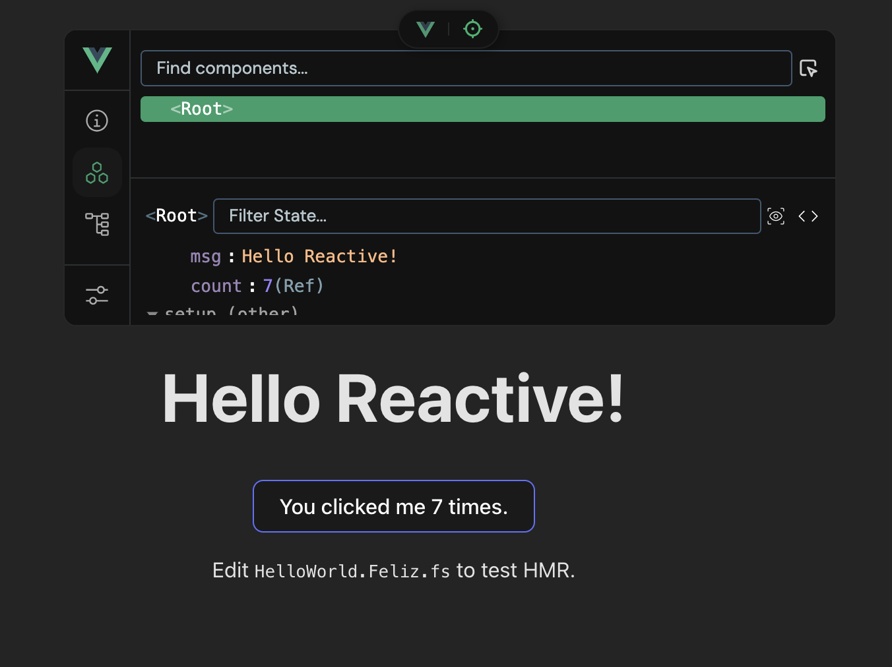

# Feliz.Vue

Test binding and example of reactive app using [Vue3 composition API](https://vuejs.org/api/composition-api-setup.html) and F# html templates and [Fable](fable.io) together with [vite-plugin-fable](https://github.com/fable-compiler/vite-plugin-fable) and [vite-plugin-vue-devtools](https://github.com/vuejs/vite-plugin-vue-devtools)

### Goals

* Enable the use of Feliz.ViewEngine bindings and DSL in Vue.js 3 composition API
* Enable the use of F# html templates in Vue.js 3 composition API
* Enable HMR for F# html templates in Vue.js 3 composition API

### Status

This is a work in progress and is not ready for production use yet.

### Run the Sample

`cd sample/my-vue-app` then:

1. `bun i`
2. `bun run dev`